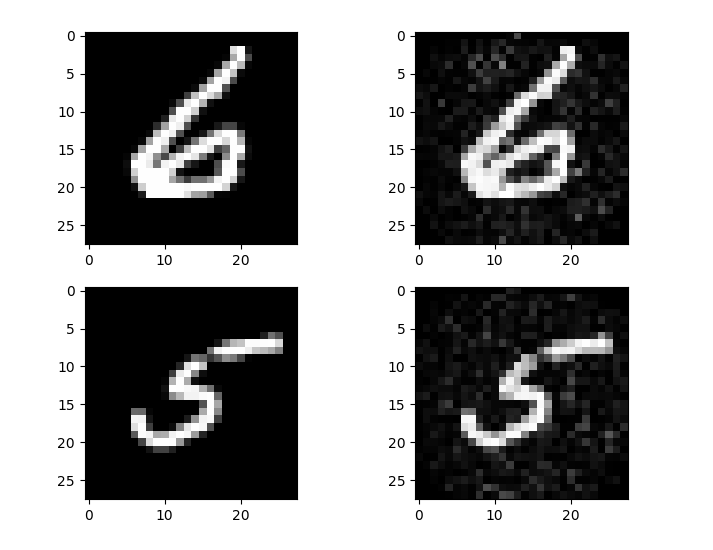

# Encoder Forest (eForest)

Non-official implementation of the paper "AutoEncoder by Forest" by Ji Feng and Zhi-Hua Zhou 2017.
https://arxiv.org/abs/1709.09018

Contrary to what the name suggests, eForest is not an ensembling method but an algorithm for
encoding high-dimensional vectors to vectors of node identifiers and decoding them back to
the original data. Given a feature vector of size n, n completely random trees are created.
Each tree is then associated to a single component of the latent vector. Indeed, a tree
is basically a function mapping input vectors to leafs. As a result, latent variable i is the
leaf identifier obtained by feeding tree i with the input vector.

A decision tree basically subdivides the input space into hyper-parallelepipeds: each decision leaf
corresponds to a unique hyper-parallelepiped. The rules used to obtained the latter can easily be
retrieved by going from the leaf to the root and saving all the split functions located on the
path to the root. Because the n embedding trees have received the same input vector to produce
the latent variables, we know that this original vector is located in the intersection of the n
hyper-parallelepipeds. Such an intersection is also a hyper-parallelepiped, and one can easily
obtain a decoded vector by randomly sampling this subspace. The combination of node rules that
describes this subspace is called the Maximal-Compatible Rule (MCR).

Suggestion for improvements: instead of randomly growing the embedding trees, construct them
in such a way that the volume of the intersection is minimized for every combination of n leafs
(one leaf per tree).



Original images and their reconstructed versions using an unsupervised eForest (500 shallow trees of depth 5)

## How to use it

```python
from encoder import EncoderForest

encoder = EncoderForest(5)
encoder.fit(X_train, max_depth=20) # Fit embedding trees (unsupervised eForest)

encoded = encoder.encode(X_train) # Encode the entire training set
decoded = encoder.decode(encoded[0]) # Decode first instance of the training set

# Intuitively, the performance of an embedding tree could be measured
# as the log(volume) returned by this tree divided by the log(volume) of the MCR.

# Get the path rules used to decode the first instance
rule_list = encoder.compute_rule_list(encoded[0])

# For each path rule (hyper-parallelepiped), compute its log(volume)
for i, path_rule in enumerate(rule_list):
    log_volume = path_rule.compute_volume()
    print("Log-volume of hyper-parallelepiped %i (tree %i): %f" % (i, i, log_volume))

# Get the intersection of the subspaces described by the path rules
MCR = self.calculate_MCR(rule_list)

# Compute the log(volume) of the subspace described by the MCR
print("MCR log-volume: %f" % MCR.compute_volume())

# Decode by generating a random sample in the final subspace
decoded = MCR.sample()
```